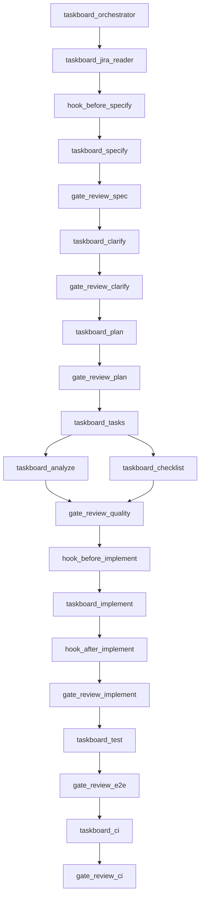

# Task search via a Jira story

Build the feature described by a Jira user story through the SpecKit cycle. One `taskboard-orchestrator` master fetches the story, then runs taskboard specialists in order. Each specialist follows the matching SpecKit skill and returns a handoff the master writes before the next launch. Quality gates and hooks abort on failure. Analysis runs in parallel, `taskboard-test` runs Playwright end-to-end after implementation, and `taskboard-ci` opens a pull request so GitHub Actions runs.

The workflow is story-agnostic. It does not choose, look up, or assume an issue key, and it does not assume the feature is search. Run the Full SDD cycle in [`.specify/workflows/speckit/workflow.yml`](../.specify/workflows/speckit/workflow.yml). The master does not read Jira, write the spec, write the plan, write tasks, or edit application code. Specialists do. A failed specialist or a rejected gate aborts the run.

The first action of a run is to take `issue_key` from the user. If it is missing, stop and ask. Do not guess a key or invent a feature seed. `taskboard-jira-reader` fetches whichever issue was given and writes `.specify/jira/<KEY>.md`. Product behavior comes only from that brief. [`.specify/memory/constitution.md`](../.specify/memory/constitution.md) still constrains how the story is built (layers, shared REST shape, `404` / `422`, schema only in `database/schema.sql`).

## Prerequisites (once, before the first run)

**Amend the constitution for end-to-end tests.** The Quality Gates section of [`.specify/memory/constitution.md`](../.specify/memory/constitution.md) currently says "Test stacks MUST stay as they are" and names Vitest and Testing Library for the frontend. Playwright would violate that, and `taskboard-analyze` treats constitution conflicts as CRITICAL, so an un-amended run aborts on its own tooling. Run the amendment through `taskboard-constitution` ([`.cursor/skills/speckit-constitution/SKILL.md`](../.cursor/skills/speckit-constitution/SKILL.md)) before any feature run:

- Add end-to-end as a stack alongside the four existing suites: Playwright in `frontend/e2e/`, run separately from `npm test -- --run`.
- State that end-to-end is the only suite allowed to hit a real database, and that the unit and API suites stay in-memory per [`.cursor/rules/tests.mdc`](../.cursor/rules/tests.mdc).
- Bump `CONSTITUTION_VERSION` (MINOR), set Last Amended, and align [`AGENTS.md`](../AGENTS.md), [`.cursor/rules/engineering.mdc`](../.cursor/rules/engineering.mdc), and `.github/copilot-instructions.md` in the same change, as the governance section requires.

**Rename rather than duplicate the agents.** Keeping nine `taskboard-*` files beside the six existing `speckit-*` files leaves two near-identical sets, which works against the constitution's preference for editing an existing file over creating a new one. Rename [`.cursor/agents/speckit-orchestrator.md`](../.cursor/agents/speckit-orchestrator.md), `speckit-specify.md`, `speckit-plan.md`, `speckit-tasks.md`, `speckit-implement.md`, and `jira-story-reader.md` to their `taskboard-` names and edit them in place. Add only the genuinely new ones: `taskboard-clarify`, `taskboard-analyze`, `taskboard-checklist`, `taskboard-test`, and `taskboard-ci`. The skills under `.cursor/skills/` keep their `speckit-` names; only agents are renamed.

## Work

- Rename the existing agents, add the new ones, and define the handoff file the master writes between launches. Add `extensions.yml` and the three hook scripts.
- At run time, take the issue key the user provides. `taskboard-jira-reader` fetches that issue and writes `.specify/jira/<KEY>.md`. If the key is missing, stop and ask.
- `taskboard-specify` follows the speckit-specify skill using only the Jira brief, then the review-spec gate runs.
- `taskboard-clarify` resolves every open question the brief or spec leaves, then the review-clarify gate runs.
- `taskboard-plan` follows the speckit-plan skill, then the review-plan constitution gate runs.
- `taskboard-tasks` follows the speckit-tasks skill, then `taskboard-analyze` and `taskboard-checklist` run in parallel and the review-quality gate runs.
- `taskboard-implement` follows the speckit-implement skill, then the after-implement unit-test hook. It does not run the browser.
- After the implement handoff is ok, `taskboard-test` runs Playwright against the acceptance scenarios and the review-e2e gate aborts on any failure.
- After review-e2e, `taskboard-ci` ensures Dockerfiles and `.github/workflows/ci.yml` exist and opens a pull request so Actions runs unit tests, compose smoke, and Docker Hub publish on `main`.

## Agents and skills

Agents live under `.cursor/agents/` with a `taskboard-` name. Do not copy skill bodies into the agents. Each specialist reads its skill and follows it exactly.

- `taskboard-orchestrator` — master. No SpecKit skill. Coordinates only.
- `taskboard-jira-reader` — no SpecKit skill. Uses Atlassian `getAccessibleAtlassianResources` and `getJiraIssue` (`view: evidence`, markdown). Writes `.specify/jira/<KEY>.md` with only what Jira returned (summary, description, acceptance criteria, constraints).
- `taskboard-specify` — [`.cursor/skills/speckit-specify/SKILL.md`](../.cursor/skills/speckit-specify/SKILL.md). Feature description is the full brief.
- `taskboard-clarify` — [`.cursor/skills/speckit-clarify/SKILL.md`](../.cursor/skills/speckit-clarify/SKILL.md). Interactive. Asks the user; does not answer for them.
- `taskboard-plan` — [`.cursor/skills/speckit-plan/SKILL.md`](../.cursor/skills/speckit-plan/SKILL.md).
- `taskboard-tasks` — [`.cursor/skills/speckit-tasks/SKILL.md`](../.cursor/skills/speckit-tasks/SKILL.md).
- `taskboard-analyze` — [`.cursor/skills/speckit-analyze/SKILL.md`](../.cursor/skills/speckit-analyze/SKILL.md). Read-only.
- `taskboard-checklist` — [`.cursor/skills/speckit-checklist/SKILL.md`](../.cursor/skills/speckit-checklist/SKILL.md). Read-only.
- `taskboard-implement` — [`.cursor/skills/speckit-implement/SKILL.md`](../.cursor/skills/speckit-implement/SKILL.md). Stops when unit tests for the touched stacks pass. Does not open a browser.
- `taskboard-test` — no SpecKit skill. Playwright end-to-end only. Does not edit production code.
- `taskboard-ci` — no SpecKit skill. Dockerfiles and GitHub Actions only. Opens a PR; does not edit application code.
- `taskboard-constitution` — [`.cursor/skills/speckit-constitution/SKILL.md`](../.cursor/skills/speckit-constitution/SKILL.md). Prerequisite only, not part of a feature run.

Launch each specialist with the Task tool, `subagent_type` equal to that agent `name`. Wait for it to finish. The prompt is the handoff path plus the fields that specialist needs, nothing else.

Two agents need interaction handled explicitly. `taskboard-clarify` must run in the foreground so its questions reach the user. `taskboard-checklist` asks up to five scoping questions, and it cannot do that when launched in parallel, so the master passes depth, audience, and focus areas in the prompt to hit the skill's "interaction impossible" defaults.

Also follow [`.cursor/rules/engineering.mdc`](../.cursor/rules/engineering.mdc). When a step touches `frontend/**` or tests, follow [`.cursor/rules/frontend.mdc`](../.cursor/rules/frontend.mdc) and [`.cursor/rules/tests.mdc`](../.cursor/rules/tests.mdc).

## Handoff

The master is the only writer of `.specify/handoff.json`. Specialists return a text block and never touch the file. Parallel specialists never touch it either. The master parses a return, checks every named path exists on disk, then writes the file. If `status` is not `ok`, or a required file is missing, the master aborts and does not launch the next agent.

Add `handoff.json` to [`.specify/.gitignore`](../.specify/.gitignore) next to `feature.json`. Both are per-checkout run state, not shared artifacts.

The file the master writes:

```json
{
  "status": "ok",
  "step": "taskboard-specify",
  "expects": "taskboard-clarify",
  "issue_key": "EYTB-12",
  "feature_directory": "specs/003-<short-name>",
  "brief_path": ".specify/jira/EYTB-12.md",
  "spec_file": "specs/003-<short-name>/spec.md",
  "plan_file": null,
  "tasks_file": null,
  "quality_stamp": null,
  "e2e_report": null,
  "tests": [],
  "blockers": "none"
}
```

Each specialist returns the same fields as a text block:

```text
status: ok | failed
step: <agent name>
issue_key: <KEY>
feature_directory: <path or none>
brief_path: <path or none>
spec_file: <path or none>
plan_file: <path or none>
tasks_file: <path or none>
e2e_report: <path or none>
tests: <command and pass/fail, one per line, or none>
blockers: none | <what failed>
```

Every specialist prompt carries `handoff_path` and the predecessor step name. The specialist reads the file first and returns `status: failed` unless `status` is `ok` and `step` matches the predecessor it was told to expect.

Predecessor required before launch:

- `taskboard-jira-reader` — `issue_key` from the user. No prior handoff.
- `taskboard-specify` — step `taskboard-jira-reader`, `brief_path` exists.
- `taskboard-clarify` — step `taskboard-specify`, `spec_file` exists.
- `taskboard-plan` — step `review-clarify`, `spec_file` has no unresolved markers.
- `taskboard-tasks` — step `taskboard-plan`, `plan_file` exists.
- `taskboard-analyze` and `taskboard-checklist` — both see step `taskboard-tasks` and the same `tasks_file`. The master launches them together and writes the handoff only after both return `ok`.
- `taskboard-implement` — step `review-quality`, `quality_stamp` exists, `tasks_file` exists.
- `taskboard-test` — step `taskboard-implement`, every entry in `tests` passed.
- `taskboard-ci` — step `review-e2e`.

Pass `issue_key` and `brief_path` into specify. Pass `feature_directory` from the handoff into clarify, plan, tasks, analyze, checklist, implement, and test.

## Agent topology



Sequential (one specialist, wait, write the handoff, then the next): Jira read, branch hook, specify, clarify, plan, tasks, implement, post-implement hook, Playwright test, CI pull request.

Parallel:

- After `tasks.md` exists, launch `taskboard-analyze` and `taskboard-checklist` in the same turn. Both only run their skills and neither writes state.
- Inside implement, the skill's `[P]` tasks run together when they touch different trees. Tasks that share a file stay sequential.

Implementation ordering comes from `tasks.md`, not from this document. A story resolved as a client-side change may have no backend tasks at all, so do not assume a backend-then-frontend sequence. When `tasks.md` does contain work in `backend-dotnet/`, `backend-python/`, and `backend-java/`, those three trees are disjoint and run together, and frontend work that depends on the shared contract waits for them.

`taskboard-plan` may fan out research inside that one specialist, as the plan skill already describes. That stays inside the plan step.

## Gates

Each gate is pass or abort. The master records the decision in `.specify/handoff.json` and in its final return. Do not start the next step after a reject.

- **review-story:** `status: ok` and `.specify/jira/<KEY>.md` exists and contains the Jira summary and description. Empty or invented requirements abort.
- **review-spec:** `spec.md` has User Scenarios and Testing, Requirements, and Success Criteria filled from the brief (not template placeholders). Requirements that are not in the brief abort. Constitution violations abort (layer skip, extra HTTP codes, schema outside `database/schema.sql`).
- **review-clarify:** no `NEEDS CLARIFICATION` markers remain in `spec.md`, and every open question the brief listed has an answer recorded in the spec. Unanswered questions abort rather than letting plan guess.
- **review-plan:** `plan.md` has Summary, Technical Context, and a passing Constitution Check.
- **review-quality:** analyze reports zero CRITICAL findings (constitution conflicts are CRITICAL). The checklist has no failed requirement items. Both parallel agents return `status: ok`. On pass, the master writes `.specify/quality-gate.json` with the feature directory, a UTC timestamp, and the two agents' verdicts, and records the path as `quality_stamp`. This file is what the before-implement hook checks.
- **review-implement:** `dotnet test`, `pytest`, `./mvnw -B test`, and `npm test -- --run` pass for every stack the story touches. Unit and API tests only. The handoff records each command and its result.
- **review-e2e:** `taskboard-test` returns `status: ok`, the Playwright run exits 0, and `e2e_report` exists under the feature directory. Every user-visible acceptance scenario in `spec.md` has a passing test. Any failed or missing scenario aborts. A story with no user-visible scenario may return `skipped` only when the spec lists none; otherwise a skip fails the gate.
- **review-ci:** `taskboard-ci` returns `status: ok`, a GitHub pull request URL is present, and the Dockerfiles, `docker-compose.yml`, and `.github/workflows/ci.yml` exist.

## Hooks

There is no `.specify/extensions.yml` today. Add one so the SpecKit skills' `before_*` / `after_*` checks actually run. Hook commands map to scripts under `.specify/extensions/hooks/`. When a skill emits `EXECUTE_COMMAND`, that specialist runs the mapped script and waits.

- `before_specify` (mandatory): create and check out the feature branch. No script does this today. [`create-new-feature.sh`](../.specify/scripts/bash/create-new-feature.sh) never touches git and does write `spec.md`, so it cannot be the hook as-is. Write a hook that calls it with `--dry-run --json` to get `BRANCH_NAME` and `FEATURE_NUM` without creating files, runs `git checkout -b "$BRANCH_NAME"`, and echoes that JSON, which is the shape the specify skill expects. The spec directory and file stay the skill's job. Short name comes from the Jira summary.
- `before_implement` (mandatory): [`.specify/scripts/bash/check-prerequisites.sh`](../.specify/scripts/bash/check-prerequisites.sh) `--require-spec --require-tasks`, plus a check that `.specify/quality-gate.json` exists and names the current feature directory. Exit non-zero otherwise.
- `after_implement` (mandatory): re-run the test commands for the stacks the story changed. Non-zero exit fails the step.

Leave `after_tasks` to the parallel analyze and checklist agents, and leave end-to-end to `taskboard-test`. A shell hook cannot launch those specialists.

## End-to-end test

`taskboard-test` runs only after the implement handoff is `ok` and review-implement has passed. Playwright is not a frontend dependency today ([`frontend/package.json`](../frontend/package.json) uses Vitest). This agent adds `@playwright/test` as a dev dependency, runs `npx playwright install chromium` (needs network on first run), keeps specs in `frontend/e2e/`, and derives cases from the spec's acceptance scenarios. It does not replace Vitest or the backend suites, and it does not edit production code.

End-to-end is the one suite that needs a real stack, which is why the constitution amendment above has to land first. `taskboard-test` owns the whole environment and tears it down when finished:

- A dedicated `taskboard_e2e` Postgres database, never the development one, created from `database/schema.sql`. Seed only what the scenarios need rather than reusing `database/seed.sql` wholesale, so assertions do not depend on shared fixture drift.
- One backend pointed at that database. The README default is the Python API on `http://localhost:8000`.
- The Vite dev server on `http://localhost:5173` with `VITE_API_BASE_URL` set to that API through `.env.local`, which the agent must write rather than read. The other two backends stay covered by their own test commands.
- Reset the database between specs so a create or delete in one scenario cannot leak into the next.

Write `e2e-report.md` in the feature directory with one line per scenario, its spec reference, and pass or fail.

## What execution changes

- Rename the six existing agent files to `taskboard-*` and add `taskboard-clarify`, `taskboard-analyze`, `taskboard-checklist`, and `taskboard-test`. SpecKit behavior stays in the skills.
- Orchestrator asks for `issue_key` at the start of a run, writes `.specify/handoff.json` after every specialist, and launches the next agent only when the predecessor check passes. Parallel launch is only for the quality pair and for `[P]` implement tasks on disjoint trees.
- Add the hook scripts, `extensions.yml`, and the `handoff.json` gitignore entry.
- Application edits happen only inside `taskboard-implement`, in `tasks.md` order, tests before behavior.
- Playwright setup, environment startup, and the browser run happen only inside `taskboard-test`.
- Dockerfiles, compose, and `.github/workflows/ci.yml` are first-class repo files. `taskboard-ci` opens a pull request so GitHub Actions is the CI gate.

## Return

```text
issue_key: <KEY>
stopped_at: <step name or complete>
feature_directory: <path or none>
artifacts: <brief, spec, plan, tasks, quality stamp, e2e report paths that exist>
handoff: .specify/handoff.json
gates: <gate name and pass/abort, one per line>
result: <what was implemented, or why the run stopped>
```
