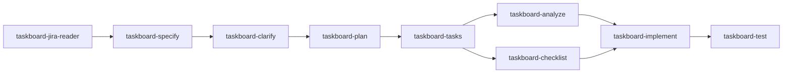

# Add `taskboard-ci` plus Docker and GitHub Actions

Add a `taskboard-ci` specialist after the e2e gate, plus first-class Dockerfiles and a GitHub Actions workflow (kept as separate files, not inlined). The agent’s job is to open a pull request so unit tests, image builds, compose smoke, and (on the default branch) Docker Hub publish actually run.

This plan supports [feature-task-priority.md](feature-task-priority.md) acceptance criteria 7–8 (compose + CI). It does not implement the priority field itself.

## Work items

- Add Dockerfiles (python, dotnet, java, frontend+nginx) and root `docker-compose.yml` with schema/seed init and healthcheck
- Add `.github/workflows/ci.yml`: unit matrix, compose smoke, Docker Hub publish on `main` only
- Add `.cursor/agents/taskboard-ci.md`: after review-e2e, ensure files, push, open PR via GitHub MCP
- Update orchestrator sequence, `hooks.json`, `subagent-start`/`subagent-stop` predecessor and `SPECIALISTS`

## What exists today

Eleven specialists under [`.cursor/agents/`](../.cursor/agents/) implement one SpecKit ADLC. The master is [`taskboard-orchestrator.md`](../.cursor/agents/taskboard-orchestrator.md). Each specialist:

- Has YAML frontmatter (`name`, `description`, `model`)
- Does **not** write [`.specify/handoff.json`](../.specify/handoff.json) (orchestrator only)
- Returns a fixed text block (`status`, `step`, paths, `tests`, `blockers`)
- Is gated by [`.cursor/hooks/subagent-start.py`](../.cursor/hooks/subagent-start.py) (`PREDECESSOR` + required path) and reminded by [`subagent-stop.py`](../.cursor/hooks/subagent-stop.py)

There is **no** `.github/workflows/` pipeline and **no** `Dockerfile` / `docker-compose.yml`. Unit suites stay in-memory ([`.cursor/rules/engineering.mdc`](../.cursor/rules/engineering.mdc)); only Playwright may hit a real DB. [feature-task-priority.md](feature-task-priority.md) AC 7–8 require compose + CI as part of that feature’s done, not a later project.

`taskboard-implement` stops at unit/API tests. `taskboard-test` owns Playwright only. CI belongs in a **new** specialist so those two stay single-purpose.

## Design split

Keep three layers of work, not one blob:

1. **Dockerfiles + compose** as repo files (images and local run).
2. **GitHub Actions YAML** as repo files (what GitHub runs).
3. **`taskboard-ci` agent** does not invent Docker in the prompt: it ensures those files exist, then **opens a PR** so Actions runs.

Docker Hub publish is **not** on every PR (forks, secret leakage, and the brief’s “no public-cloud deploy”). On **pull_request**: unit tests + image build + compose smoke. On **push to `main`**: same jobs, then `docker login` + push using repo secrets `DOCKERHUB_USERNAME` and `DOCKERHUB_TOKEN`. Image names: `$DOCKERHUB_USERNAME/taskboard-{frontend,python,dotnet,java}` tagged with `sha` and `latest` on `main`.

## 1. Docker artifacts (separate from the agent prompt)

Default compose stack matches e2e: **Postgres 15 + Python API + frontend**. Profiles `dotnet` / `java` swap the API image (same contract, ports 5088 / 8080).

| File | Role |
| --- | --- |
| [`backend-python/Dockerfile`](../backend-python/Dockerfile) | Python 3.11, `uvicorn` on 8000, `DATABASE_URL` / `FRONTEND_ORIGIN` from env |
| [`backend-dotnet/Dockerfile`](../backend-dotnet/Dockerfile) | multi-stage SDK 8 → aspnet 8, listen 5088 |
| [`backend-java/Dockerfile`](../backend-java/Dockerfile) | multi-stage Temurin 21 + `./mvnw` → JRE, 8080 |
| [`frontend/Dockerfile`](../frontend/Dockerfile) | Node 20 build; nginx that serves the SPA and **proxies `/api` and `/health`** to the API service so the browser does not need a host SDK URL |
| [`frontend/nginx.conf`](../frontend/nginx.conf) | reverse proxy (small, required for compose) |
| [`docker-compose.yml`](../docker-compose.yml) | `db` mounts [`database/schema.sql`](../database/schema.sql) and [`database/seed.sql`](../database/seed.sql) into `docker-entrypoint-initdb.d`; `api` + `web`; healthcheck on `GET /health`; non-secret defaults `postgres` / `postgres` / `taskboard` as in the README |

Unit/API tests **must not** use this Postgres. Compose is only for smoke (and local `docker compose up`).

Smoke against composed stack (CI job, after `docker compose up -d --wait`):

- `GET /health` → 200
- `POST /api/tasks` with `"priority": "high"` (and title) → 201 once the priority feature is on the branch; until then the same job can POST without `priority` if the column is not in schema yet — the agent should match the current `schema.sql` / spec so smoke does not lie

## 2. GitHub Actions (separate workflow file)

Add [`.github/workflows/ci.yml`](../.github/workflows/ci.yml):

- **Triggers:** `pull_request` and `push` to `main`
- **Job `unit`:** parallel matrix — `dotnet test` in `backend-dotnet/`, `pytest` in `backend-python/`, `./mvnw -B test` in `backend-java/`, `npm test -- --run` in `frontend/`. No Docker DB.
- **Job `compose-smoke`:** needs `unit`; `docker compose build` + `up`; curl health + create/list task; `docker compose down -v`. Default profile = Python API.
- **Job `publish`:** `if: github.event_name == 'push' && github.ref == 'refs/heads/main'`; needs `compose-smoke`; `docker/login-action` + push the four images. Fail closed if secrets are missing on `main` (document that the operator must add them in GitHub; never commit them).

Do not add a second workflow unless we later want `workflow_dispatch` only.

## 3. New agent [`.cursor/agents/taskboard-ci.md`](../.cursor/agents/taskboard-ci.md)

Match existing frontmatter (`name: taskboard-ci`, `model: grok-4.7[fast=false]`). No SpecKit skill (same as `taskboard-test` / `taskboard-jira-reader`).

**When:** orchestrator delegates after **review-e2e**. Predecessor step in handoff: `review-e2e` (orchestrator writes that after Playwright passes).

**Must not:** edit application/product code, rewrite spec/plan, write `handoff.json`, run Playwright, or point unit tests at compose Postgres.

**Steps:**

1. Read handoff; fail unless `status` is `ok` and `step` is `review-e2e`.
2. If Dockerfiles, `docker-compose.yml`, or `.github/workflows/ci.yml` are missing, **write only those files** (same layout as section 1–2). Prefer editing existing files over duplicating.
3. Use GitHub MCP (already allowed by [`before-mcp.py`](../.cursor/hooks/before-mcp.py) for non-Atlassian servers): `get_me` / origin `owner`+`repo`, `create_branch` if needed, `push_files` for the Docker + workflow paths, `create_pull_request` (`base: main`, `head: <feature-branch>`, title/body from the issue key + “CI: unit tests, compose smoke, Docker Hub on main”).
4. Return `pr_url` and `status: ok`. Opening the PR **is** the trigger. Do not block the ADLC on Actions going green (async); record `tests: github-actions — triggered`.

Return block: same fields as other specialists, plus `pr_url` in `blockers: none` or as a dedicated line `pr_url:`.

## 4. Wire the orchestrator and hooks

Update [`taskboard-orchestrator.md`](../.cursor/agents/taskboard-orchestrator.md):

- After **review-e2e**, write `expects: taskboard-ci`, then launch `taskboard-ci`.
- **review-ci:** pass when specialist `status` is `ok` and a PR URL exists. Abort if Docker/workflow files are still missing.

Update [`.cursor/hooks.json`](../.cursor/hooks.json), [`subagent-start.py`](../.cursor/hooks/subagent-start.py) (`PREDECESSOR["taskboard-ci"] = "review-e2e"`), and [`subagent-stop.py`](../.cursor/hooks/subagent-stop.py) (`SPECIALISTS` add `taskboard-ci`).

Optionally align [`plan-task-search.md`](plan-task-search.md) so the agent catalogue stays accurate (one extra specialist after e2e). No constitution change required unless you want CI named as a quality gate; unit suites already are.

## 5. What this does *not* do

- Does not implement the priority column, badge, or API filter (that stays `taskboard-implement` from `tasks.md`).
- Does not run `docker compose` inside the Cursor agent as the official gate; GitHub Actions is the gate, triggered by the PR.
- Does not commit [`.cursor/mcp.json`](../.cursor/mcp.json) (contains credentials).

## Operator setup (outside the repo)

GitHub repo secrets: `DOCKERHUB_USERNAME`, `DOCKERHUB_TOKEN`. Without them, PR CI still runs; `publish` on `main` fails until they exist.
