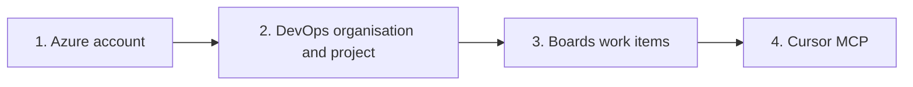

# Connect Azure Boards to Cursor

| Field | Value |
| --- | --- |
| Document | EY Engineering Task Board — Azure Boards and Cursor MCP |
| Audience | Software engineers setting up Azure Boards for local Cursor work |
| Classification | Internal use |
| Last updated | 25 September 2026 |

This procedure takes you from a new Azure account to work items on Azure Boards that Cursor can read and update through the Azure DevOps Model Context Protocol (MCP) server.



| Part | Outcome |
| --- | --- |
| 1 | Signed-in Azure account with an active subscription |
| 2 | Organisation at `https://dev.azure.com/{YourOrganization}` and a project with Boards enabled |
| 3 | At least one work item on the team board |
| 4 | Cursor Agent chat can list projects and work items |

Microsoft documents two MCP servers: a **hosted remote** server (`https://mcp.dev.azure.com`) and a **local** server (`npx @azure-devops/mcp`). For Cursor on this repository, use the **local** server first. It works with a Microsoft account sign-in and does not require a Microsoft Entra app registration. The remote server is included as an optional path for Entra-backed organisations.

Official references:

- [Create an Azure DevOps organisation](https://learn.microsoft.com/en-us/azure/devops/organizations/accounts/create-organization?view=azure-devops)
- [Create a project](https://learn.microsoft.com/en-us/azure/devops/organizations/projects/create-project?view=azure-devops)
- [Work items and work item types](https://learn.microsoft.com/en-us/azure/devops/boards/work-items/about-work-items?view=azure-devops)
- [Azure DevOps MCP Server overview](https://learn.microsoft.com/en-us/azure/devops/mcp-server/mcp-server-overview?view=azure-devops)
- [Remote Azure DevOps MCP Server](https://learn.microsoft.com/en-us/azure/devops/mcp-server/remote-mcp-server?view=azure-devops)
- [Local MCP getting started (includes Cursor)](https://github.com/microsoft/azure-devops-mcp/blob/main/docs/GETTINGSTARTED.md)

---

## Prerequisites

- A web browser
- Cursor IDE
- Node.js 20 or later (already required for the `frontend/` app in this repository)
- Permission to create an Azure subscription, or an existing subscription you can attach to a new Azure DevOps organisation

New Azure DevOps organisations require an **active Azure subscription**. Free Trial and some student subscriptions are often rejected. A Pay-As-You-Go subscription is the usual path after a free Azure account.

---

## Part 1 — Register a Microsoft Azure account

1. Open [Create your Azure free account](https://azure.microsoft.com/free/).
2. Select **Start free** (or **Sign in** if you already have a Microsoft, work, or school account).
3. Sign in with one of:
   - a personal Microsoft account (outlook.com, hotmail.com, or a Microsoft account on a custom domain)
   - a work or school account in Microsoft Entra ID
4. Complete identity verification (phone and payment method). Azure uses the card to confirm identity. Free-tier credits still apply if you stay within the published limits.
5. Accept the subscription agreement and create the account.
6. Open [Azure portal](https://portal.azure.com) and confirm:
   - you can see a subscription under **Subscriptions**
   - the subscription **Status** is **Active**

**Work or school accounts.** If your firm already provisions Azure, skip signup and use the subscription your tenant admin assigns. Creating a personal organisation under a corporate identity can violate tenant policy.

**Record for later steps**

| Item | Example | Your value |
| --- | --- | --- |
| Sign-in email | `engineer@contoso.com` | |
| Subscription name | `Pay-As-You-Go` | |

---

## Part 2 — Set up an Azure DevOps organisation and project

Organisations cannot be created through the public Azure DevOps REST API. Create them in the web portal.

### 2.1 Create the organisation

1. Sign in at [https://dev.azure.com](https://dev.azure.com).
2. Select **New organization**. If you already belong to organisations, open the organisation picker in the top left, then **New organization**.
3. Enter an organisation name. Rules:
   - English letters, numbers, and hyphens only
   - start and end with a letter or number
   - fewer than 50 characters
4. Select a hosting geography close to the team.
5. Select the **Azure subscription** from Part 1 for billing.
6. Select **Continue**.

You are the organisation owner. The organisation URL is:

`https://dev.azure.com/{YourOrganization}`

The MCP server argument is the **organisation name only** (`{YourOrganization}`), not the full URL.

### 2.2 Create the project

1. Stay on the organisation home page, or go to `https://dev.azure.com/{YourOrganization}`.
2. Select **New project**.
3. Complete the form:

   | Field | Recommended value for this training repo |
   | --- | --- |
   | Project name | `ey-taskboard` (or your team name) |
   | Description | Optional |
   | Visibility | **Private** |
   | Version control | **Git** |
   | Work item process | **Agile** |

4. Select **Create**.

**Why Agile.** Azure Boards “issues” in conversation usually mean **work items**. The **Basic** process uses a type literally named Issue. The **Agile** process uses User Story, Bug, Task, Feature, and Epic — closer to how this Kanban training board is discussed. Either process works with MCP; stay consistent.

### 2.3 Confirm Boards is available

1. Open the project.
2. In the left sidebar, select **Boards**.
3. Confirm you can open **Work items**, **Boards**, and **Backlogs**.

If **Boards** is missing, the feature may be turned off: **Project settings** → **Overview** → **Azure DevOps services** → enable **Boards**.

---

## Part 3 — Create work items in Boards

Azure DevOps stores each unit of work as a **work item**. The type you see depends on the process from Part 2.

| Process | Backlog item you create on the board |
| --- | --- |
| Basic | Issue |
| Agile | User Story |
| Scrum | Product Backlog Item |

### 3.1 Create a work item from Work items

1. Open `https://dev.azure.com/{YourOrganization}/{YourProject}`.
2. Select **Boards** → **Work items**.
3. Select **New Work Item**.
4. Choose **Issue** (Basic) or **User Story** (Agile).
5. Enter a **Title** (required, 255 characters or fewer). Example: `Search tasks on the board`.
6. Add a **Description**. Include acceptance criteria if you have them.
7. Optionally set **Assigned To**, **Area**, and **Iteration**.
8. Select **Save and Close**. Azure DevOps assigns a numeric ID.

### 3.2 Create a card on the Kanban board

1. Select **Boards** → **Boards**.
2. Confirm the team board (top of the page) is the project’s default team.
3. In the **New** (or **To Do**) column, select **New item**.
4. Type the title and press Enter.
5. Open the card to add description, assignee, and tags.
6. Drag the card between columns to change **State**. State names follow the process (for example New → Active → Closed on Agile User Stories).

Create at least two items so you can verify MCP list and filter behaviour later.

### 3.3 Optional — invite the team

1. **Project settings** → **Permissions** (or **Teams**).
2. Add users by email.
3. Grant **Basic** access for full Boards use. Stakeholder access cannot use every Boards feature.

---

## Part 4 — Connect Azure Boards to Cursor via MCP

The local Azure DevOps MCP server runs on your machine through `npx` and talks to Azure DevOps with your signed-in account. Cursor loads it from `.cursor/mcp.json`.

Do not run the remote and local Azure DevOps MCP servers at the same time.

### 4.1 Enable the local MCP server (recommended)

1. Confirm Node.js 20+:

   ```bash
   node -v
   ```

2. Open this repository’s `.cursor/mcp.json`. This project already defines other MCP servers. **Add** an `ado` entry; do not delete existing servers.

3. Merge the following block into `mcpServers`. Replace `{YourOrganization}` with the organisation name from Part 2 (no `https://`, no project name):

   ```json
   "ado": {
     "command": "npx",
     "args": ["-y", "@azure-devops/mcp", "{YourOrganization}"]
   }
   ```

   A complete file with only Azure DevOps would look like this:

   ```json
   {
     "mcpServers": {
       "ado": {
         "command": "npx",
         "args": ["-y", "@azure-devops/mcp", "{YourOrganization}"]
       }
     }
   }
   ```

4. Save the file.
5. In Cursor, open **Settings** → **Tools & MCP** (or **Tools & Integrations**).
6. Confirm the `ado` server is listed and **enabled**. Cursor may prompt you to enable a newly detected server.
7. Open **Agent** chat (not Ask mode). MCP tools run in Agent mode.
8. On first Azure DevOps tool use, complete the browser Microsoft sign-in with the same account that owns or can access the organisation.

**Do not** put a Personal Access Token in `mcp.json`. Interactive sign-in is the default. If your environment cannot open a browser, use Azure CLI (`az login`) and add `"--authentication", "azcli"` to `args` after the organisation name.

### 4.2 Verify in Agent chat

Use prompts that name the project. Microsoft also recommends adding “Do not use previously fetched data” if a previous session cached results.

Examples:

- `List Azure DevOps projects in this organisation. Do not use previously fetched data.`
- `List work items in project {YourProject}.`
- `Get work item {id} and summarise title, state, and assigned to.`

You should see MCP tool calls for the `ado` server and data that matches the board from Part 3.

### 4.3 Optional — local server with a Personal Access Token

Use this only when interactive or Azure CLI auth is not available (headless CI-style machines).

1. In Azure DevOps: **User settings** → **Personal access tokens** → **New Token**.
2. Scope the token to **Work Items** (Read or Read & write) and **Project and Team** (Read). Set a short expiry.
3. Store the token outside git. Do not commit it.
4. Follow the encoding step in [Getting started — Personal Access Token](https://github.com/microsoft/azure-devops-mcp/blob/main/docs/GETTINGSTARTED.md): set `PERSONAL_ACCESS_TOKEN` to the base64 encoding of `{email}:{pat}`, then add `"--authentication", "pat"` to the MCP `args`.

### 4.4 Optional — remote MCP server (Microsoft Entra)

Use the remote server only if:

- the Azure DevOps organisation is **backed by Microsoft Entra ID** (standalone Microsoft accounts are not supported on the remote server), and
- a tenant administrator can register an app.

Cursor cannot use dynamic OAuth client registration with Microsoft Entra. You must register an app.

1. In Microsoft Entra admin center, confirm the Azure DevOps MCP enterprise application exists in the tenant. If it is missing, see [Can't find the Azure DevOps MCP enterprise application](https://learn.microsoft.com/en-us/azure/devops/mcp-server/remote-mcp-server?view=azure-devops).
2. **App registrations** → **New registration**.
3. **Authentication (Preview)** → **Add redirect URI** → **Mobile and desktop applications**.
4. Set the redirect URI to `http://localhost:8787/callback`. Save.
5. On **Authentication (Preview)** → **Settings**, enable **Allow public client flows**.
6. **API permissions** → **Add a permission** → **APIs my organization uses**.
7. Search for **Azure DevOps MCP** or application ID `2a72489c-aab2-4b65-b93a-a91edccf33b8`. Add the delegated permissions you need. Grant admin consent if your role requires it.
8. Copy the **Application (client) ID**.
9. In Cursor, **Settings** → **Tools & MCP** → **New MCP Server**, then add:

   ```json
   {
     "mcpServers": {
       "ado": {
         "url": "https://mcp.dev.azure.com",
         "type": "http",
         "auth": {
           "CLIENT_ID": "{client-id}"
         }
       }
     }
   }
   ```

10. Save. Return to **Tools & MCP**, locate **ado**, and select **Authenticate**.

Do not commit client secrets. Cursor Cloud Agents need an extra web redirect (`https://www.cursor.com/agents/mcp/oauth/callback`) and a client secret; see the [remote MCP Cursor Cloud Agents section](https://learn.microsoft.com/en-us/azure/devops/mcp-server/remote-mcp-server?view=azure-devops).

---

## Troubleshooting

| Symptom | What to check |
| --- | --- |
| Cannot create an Azure DevOps organisation | Active Azure subscription; supported account type; organisation name rules; try another browser |
| **New project** is missing | You need Project Collection Administrators, or **Create new projects** = Allow |
| Boards hub missing | Enable **Boards** under project **Azure DevOps services** |
| Cursor does not list `ado` tools | Agent mode; server enabled; Node.js 20+; organisation name in `args` matches `https://dev.azure.com/{YourOrganization}` |
| Sign-in loop or access denied | Same account as the organisation; you are a project member |
| Remote MCP OAuth fails in Cursor | Expected without a custom Entra app; use Part 4.1 instead |
| Stale work item data in chat | Add “Do not use previously fetched data” to the prompt |

---

## Security checklist

- Prefer interactive or Azure CLI authentication over long-lived PATs.
- Never commit PATs, `CLIENT_SECRET`, or GitHub tokens in `.cursor/mcp.json`.
- Keep Azure DevOps projects **Private** unless the organisation standard requires otherwise.
- Limit MCP write access: start with read-only prompts; grant Work Items write on a PAT only when Agent must create or update items.

When Part 4 verification succeeds, Cursor can use Azure Boards work items as the source for feature work in this repository, in the same way Jira is used through the Atlassian MCP server.